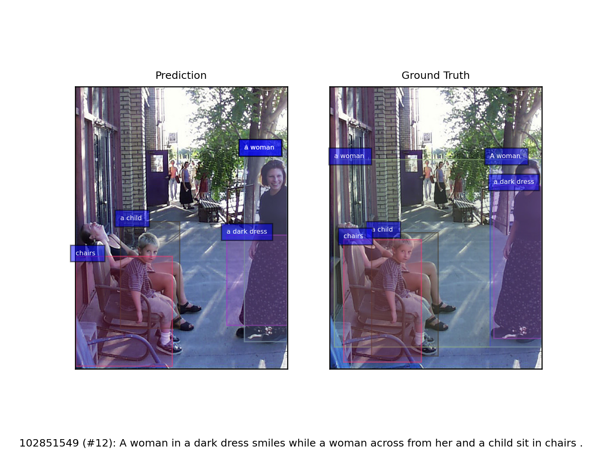

# Weakly Supervised Visual-Textual Grounding based on Concept Similarity

This repository contains the code for my MS thesis.



*Fig. 1*. Example output of our model. At test time, given a sentence *S* and an
image *I*, the model is required to ground noun phrases in *S*, each with the
most likely proposal among proposals extracted by an object detector on *I*.

The model is built with Python 3 and PyTorch.

## Abstract

We address the problem of phrase grounding, i.e. the task of locating the
content of the image referenced by the sentence, by using weak supervision.
Phrase grounding is a challenging problem that requires joint understanding of
both visual and textual modalities, while being an important application in many
field of study such as visual question answering, image retrieval and robotic
navigation. We propose a simple model that leverages on concept similarity, i.e.
the similarity between a concept in phrases and the proposal bounding boxes
label. We apply such measure as a prior on our model prediction. Then the model
is trained to maximize multimodal similarity between an image and a sentence
describing that image, while minimizing instead the multimodal similarity
between the image and a sentence not describing the image. Our experiments shows
comparable performance with respect to State-of-the-Art works.

[Read the dissertation 🚀](https://github.com/lparolari/master-thesis/releases/download/latest/parolari-luca_master-thesis.pdf)

## Usage

Model parameters and workflow are settable from the command line interface, 
run

```sh
python main.py --help
```

to show the help message.

Go to the requirement section in order to install all dependencies and see data
section to prepare datasets.

### Commands

Some examples:

1. Train the model

```sh
python main.py \
  --use-wandb \
  --workflow train \
  --log-level 10 \
  --num-workers 8 \
  --prefetch-factor 2 \
  --suffix awesome \
  --n-epochs 30 \
  --n-box 100 \
  --learning-rate 0.001 \
  --use-spell-correction \
  --word-embedding w2v \
  --localization-strategy max \
  --text-embedding-size 300 \
  --text-recurrent-network-type lstm \
  --text-semantic-size 1000 \
  --text-semantic-num-layers 1 \
  --image-embedding-size 2053 \
  --image-projection-net mlp \
  --image-projection-size 1000 \
  --image-projection-hidden-layers 0 \
  --apply-concept-similarity-strategy mean \
  --apply-concept-similarity-weight 0.5
```

2. Restore a trained model and test it

```sh
python main.py \
  --use-wandb \
  --workflow test \
  --log-level 10 \
  --num-workers 8 \
  --prefetch-factor 2 \
  --n-epochs 30 \
  --n-box 100 \
  --learning-rate 0.001 \
  --use-spell-correction \
  --word-embedding w2v \
  --localization-strategy max \
  --text-embedding-size 300 \
  --text-recurrent-network-type lstm \
  --text-semantic-size 1000 \
  --text-semantic-num-layers 1 \
  --image-embedding-size 2053 \
  --image-projection-net mlp \
  --image-projection-size 1000 \
  --image-projection-hidden-layers 0 \
  --apply-concept-similarity-strategy mean \
  --apply-concept-similarity-weight 0.5 \
  --restore /path/to/model_awesome_17.pth
```

### Requirements

1. Install [Python](https://www.python.org/)

2. Install [Anaconda](https://www.anaconda.com/)

3. Install dependencies
```
conda env create -n weakvtg -f environment.yml
```

4. Download [spaCy](https://spacy.io/) resources
```
python -m spacy download en_core_web_sm
```

_Note_: the first execution may require some time for the downloading of 
[GloVe](https://nlp.stanford.edu/projects/glove/) or 
[Word2Vec](https://code.google.com/archive/p/word2vec/) pretrained word 
embeddings.

_Note_: depending on your system, you may need to install PyTorch compiled for 
CPU-only.

### Data

In order to run the model, you need to download 
[ReferIt](http://tamaraberg.com/referitgame/) and 
[Flickr30k Entities](https://github.com/BryanPlummer/flickr30k_entities) 
datasets.

The model loads data from the `data` folder, so I suggest creating two local 
folder (e.g., `referit_data` and `flickr30k_data`) and symlink one of the 
two: `ln -s referit_data data`.

**ReferIt**

The ReferIt data folder MUST be structured as follows:

```
referit_data
|-- attributes_vocab.txt
|-- objects_vocab.txt
|-- refer
|   |-- data
|   |-- evaluation
|   |-- external
|   |-- LICENSE
|   |-- Makefile
|   |-- pyEvalDemo.ipynb
|   |-- pyReferDemo.ipynb
|   |-- README.md
|   |-- refer.py
|   |-- setup.py
|   `-- test
`-- referit_raw
    |-- out_bu
    |-- out_ewiser
    |-- preprocessed
    |-- test.txt
    |-- train.txt
    |-- val.txt
    |-- vocab.json
    |-- vocab_yago.json
    `-- yago_align.json
```

where `refer` is the exact clone of [ReferIt](http://tamaraberg.com/referitgame/)
while `referit_raw` contains our preprocessed data.

**Flickr30k Entities**

The Flickr30k Entities data folder MUST be structured as follows:

```
flickr30k_data
|-- attributes_vocab.txt
|-- flickr30k
|   |-- flickr30k_entities
|   `-- flickr30k_images
|-- flickr30k_raw
|   |-- out_bu
|   |-- out_ewiser
|   |-- out_ewiser_queries
|   |-- preprocessed
|   |-- preprocessed3
|   |-- vocab.json
|   |-- vocab_yago.json
|   `-- yago_align.json
|-- objects_vocab.txt
`-- relations_vocab.txt
```

where `flickr30k` folder Flickr's annotations and images. Annotations can be 
found at [Annotations.zip](https://github.com/BryanPlummer/flickr30k_entities/blob/master/annotations.zip)
on Flickr30k Entities repository, while images can be downloaded from 
original [Flickr30k](http://shannon.cs.illinois.edu/DenotationGraph/) dataset.

**Preprocessed Data (both dataset)**

The code used for data preprocessing can be found at 
[VTKEL-solver](https://github.com/drigoni/VTKEL-solver) (see the 
[paper](https://arxiv.org/pdf/2108.05308.pdf)).

NOTE: at time of writing, the VTKEL-solver repository is not yet public. Please 
if you need our preprocessing pipeline please write me at 
[luca.parolari23@gmail.com](mailto:luca.parolari23@gmail.com).

## Related Works

* [master-thesis](https://github.com/lparolari/master-thesis), thesis dissertation (LaTeX source code + artifacts).
* [master-thesis-presentation](https://github.com/lparolari/master-thesis-presentation), 
  thesis presentation + talk (LaTex source code + artifacts).
* [master-thesis-report](https://github.com/lparolari/master-thesis-report), quasi-final thesis report (LaTeX source code + artifacts).
* [master-thesis-log](https://github.com/lparolari/master-thesis-log), contains 
  scripts, notebooks, notes, todos and logs about the thesis.

## Author

**Luca Parolari**

- Email: [luca.parolari23@gmail.com](mailto:luca.parolari23@gmail.com)
- GitHub: [@lparolari](https://github.com/lparolari)
- Telegram: [@lparolari](https://t.me/lparolari)

Honor mention:

**Davide Rigoni**

- Email: [davide.rigoni.2@phd.unipd.it ](mailto:davide.rigoni.2@phd.unipd.it)
- GitHub: [@drigoni](https://github.com/drigoni)
- Website: [www.drigoni.it](http://www.drigoni.it/)

## License

MIT
